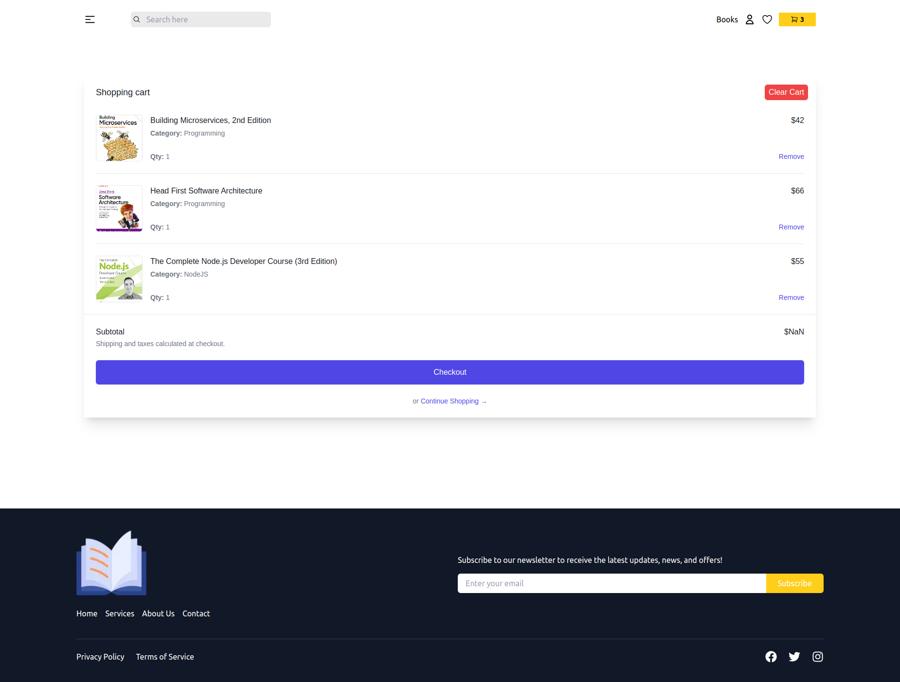
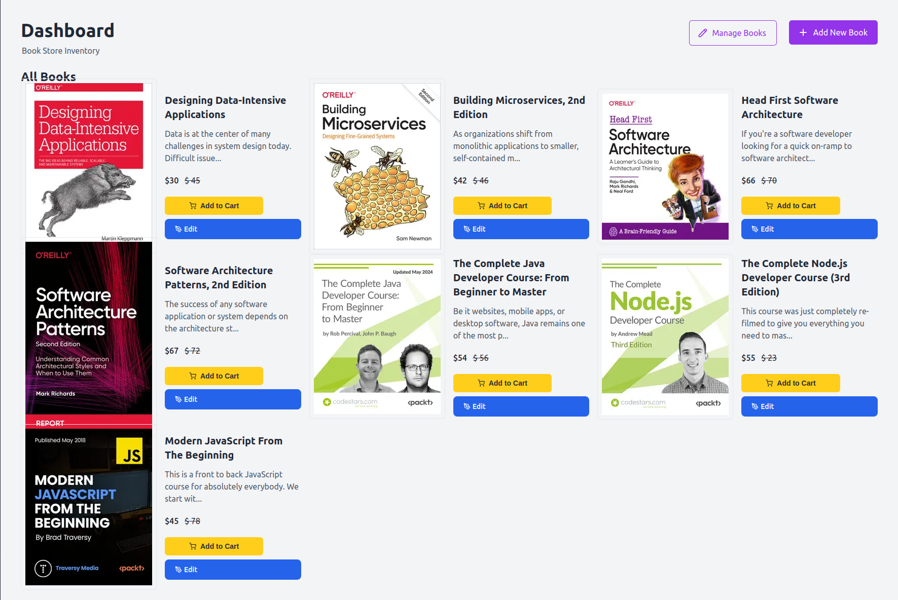

# MERN Bookstore

|           Cart Page            |           Admin Dashboard           |
| :----------------------------: | :---------------------------------: |
|  |  |

<h1 align="center">MERN Bookstore</h1>

A full-stack bookstore application built with **React**, **Redux Toolkit**, **Express**, and **MongoDB**. Users can browse books, manage their cart, and make purchases, while admins can manage inventory and track analytics.

## About The Project

**MERN Bookstore** is a modern web application that provides an interactive and user-friendly platform for book enthusiasts. The application consists of a **React frontend** for seamless user experience and an **Express/MongoDB backend** to handle data storage, authentication, and API endpoints.

### Features

- **User Authentication**: Secure login and registration using **JWT** and password hashing with **bcrypt**.
- **Book Management**: View, add, edit, and delete books from the inventory (admin feature).
- **Cart Functionality**: Users can add/remove books from their cart and proceed to checkout.
- **Real-time Analytics**: **Chart.js** integration for displaying sales and inventory statistics.
- **Firebase Integration**: Image uploads for book covers.
- **Responsive UI**: Styled with **Tailwind CSS** and interactive elements via **SweetAlert2**.
- **RESTful API**: Efficient API endpoints with **Express.js**.

## Built With

### Frontend

- **React 19**
- **Redux Toolkit** (state management)
- **React Router** (navigation)
- **Axios** (API requests)
- **Chart.js** (analytics visualization)
- **Tailwind CSS** (modern styling)
- **Firebase** (image storage)

### Backend

- **Node.js & Express.js** (server and API handling)
- **MongoDB & Mongoose** (database management)
- **JWT & bcrypt** (authentication security)
- **dotenv** (environment variable management)
- **CORS** (secure API communication)

## What I Learned

Developing **MERN Bookstore** helped me enhance my skills in:

- Structuring a **full-stack MERN application**.
- Implementing **secure authentication** using **JWT & bcrypt**.
- Managing global state efficiently with **Redux Toolkit**.
- Working with **MongoDB & Mongoose** for dynamic data storage.
- Visualizing data using **Chart.js**.
- Handling **file uploads** via **Firebase**.
- Writing clean and maintainable API endpoints with **Express.js**.

## Useful Resources

1. [React Documentation](https://react.dev/)
2. [Redux Toolkit Docs](https://redux-toolkit.js.org/)
3. [Express.js Guide](https://expressjs.com/)
4. [MongoDB Official Docs](https://www.mongodb.com/docs/)
5. [Chart.js Guide](https://www.chartjs.org/)

## Acknowledgments

This project is a step forward in mastering **Full-stack development**. Thanks to the open-source community for providing valuable libraries and resources that made this project possible.
